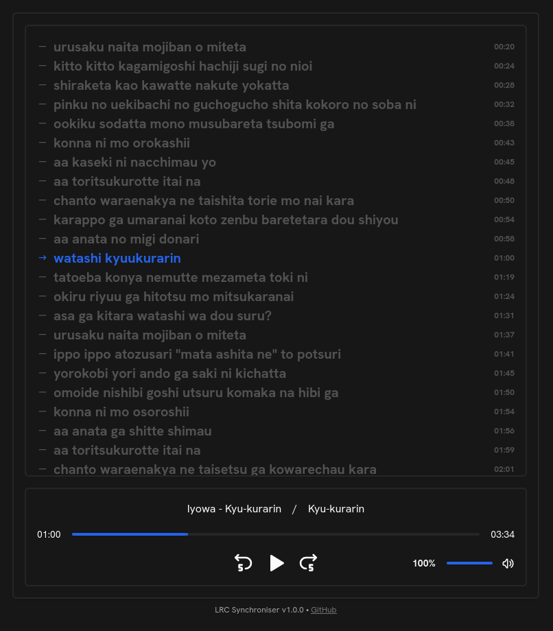

# LRC Synchroniser

LRC Synchroniser is a simple webpage in Svelte which purpose is to display
synced lyrics (.lrc) along with audio in real-time. This is my first front-end
project in written using [Svelte](https://svelte.dev), and also
[TailwindCSS](https://tailwindcss.com).

License: [MIT](./LICENSE)
